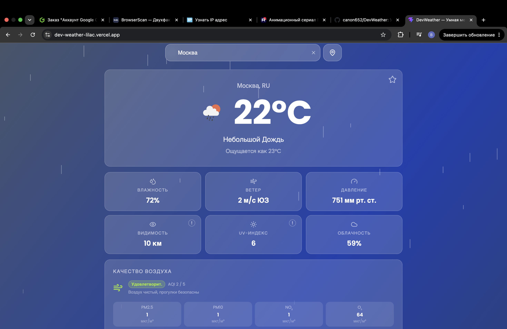
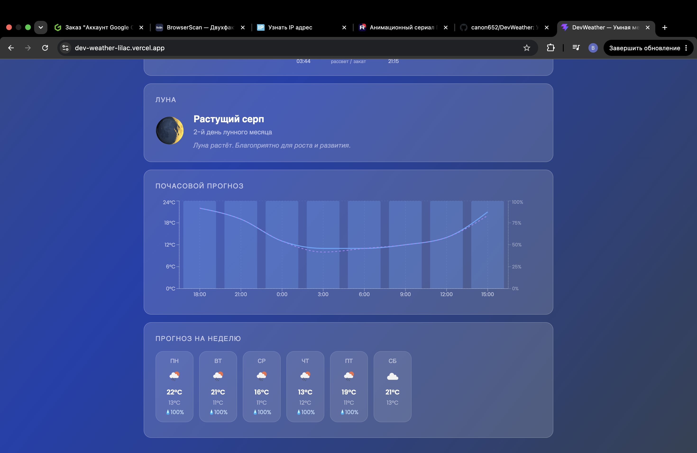
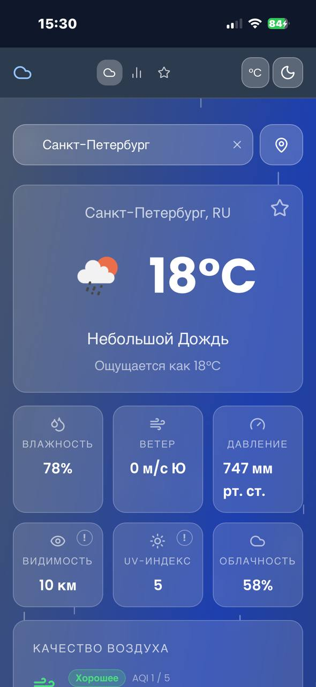

# DevWeather 🌤

Умная метеостанция с аналитикой — портфолио-проект на React + Vite.

**Live demo:** [dev-weather-lilac.vercel.app](https://dev-weather-lilac.vercel.app)

## Скриншоты

<table>
  <tr>
    <td></td>
    <td></td>
  </tr>
  <tr>
    <td align="center"><em>Главная — карточка погоды и метрики</em></td>
    <td align="center"><em>Почасовой график и прогноз на неделю</em></td>
  </tr>
</table>

<p align="center">
  
  <br/><em>Адаптивная мобильная версия (PWA)</em>
</p>

## Что умеет

- Поиск любого города мира с подсказками на русском языке
- Автоопределение местоположения по геолокации
- Текущая погода: температура, ощущаемая, иконка, описание
- 6 метрик: влажность, ветер, давление, видимость, UV-индекс, облачность
- Качество воздуха (AQI) с разбивкой по PM2.5, PM10, NO₂, O₃
- Вероятность осадков в прогнозе
- Почасовой график температуры + осадки (Recharts)
- Фаза луны и восход/закат солнца
- Прогноз на 7 дней с детализацией по дням
- Сравнение погоды до 3 городов одновременно
- Избранные города
- Переключение °C / °F
- Светлая / тёмная тема
- Анимированный фон зависящий от погоды (дождь, снег, молния, облака)
- PWA — устанавливается на телефон как приложение
- Кэширование запросов (30 мин, localStorage)

## Стек

| Технология | Использование |
|---|---|
| **React 19** + **Vite 8** | UI и сборка |
| **Tailwind CSS v3** | Glassmorphism UI, адаптивность |
| **Recharts** | Почасовой график (температура + осадки) |
| **React Router v6** | 3 страницы: Dashboard, Compare, Saved |
| **OpenWeatherMap API** | Погода, прогноз, AQI, геокодирование |
| **Open-Meteo API** | UV-индекс, температура воды |
| **vite-plugin-pwa** | PWA, сервис-воркер, офлайн-кэш |

## Запуск локально

```bash
# 1. Клонировать репозиторий
git clone https://github.com/canon652/DevWeather.git
cd DevWeather

# 2. Установить зависимости
npm install

# 3. Создать .env с API ключом OpenWeatherMap
echo "VITE_WEATHER_API_KEY=ваш_ключ" > .env

# 4. Запустить dev-сервер
npm run dev
```

Бесплатный API ключ: [openweathermap.org](https://openweathermap.org) → Sign Up → API Keys

## Структура проекта

```
src/
├── api/             # weatherApi.js, geocodingApi.js
├── hooks/           # useWeather, useLocalStorage
├── context/         # SettingsContext (тема, единицы, код погоды)
├── utils/           # formatTemp, weatherBackground, cache
├── components/
│   ├── WeatherCard/     # Карточка с температурой
│   ├── MetricsGrid/     # 6 метрик
│   ├── AirQuality/      # Виджет AQI
│   ├── HourlyChart/     # Recharts график
│   ├── WeekForecast/    # Прогноз на 7 дней
│   ├── WeatherAnimation/# Анимации фона
│   └── ...
└── pages/
    ├── Dashboard.jsx    # Главная
    ├── Compare.jsx      # Сравнение городов
    └── Saved.jsx        # Избранное
```
